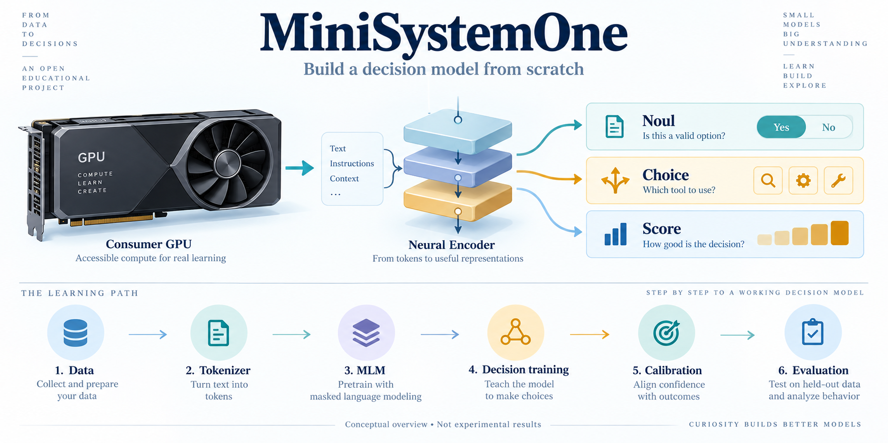
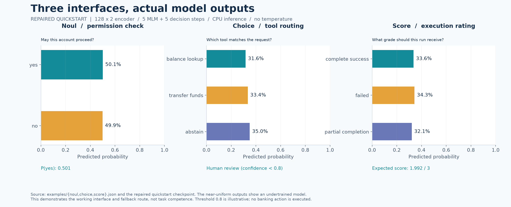
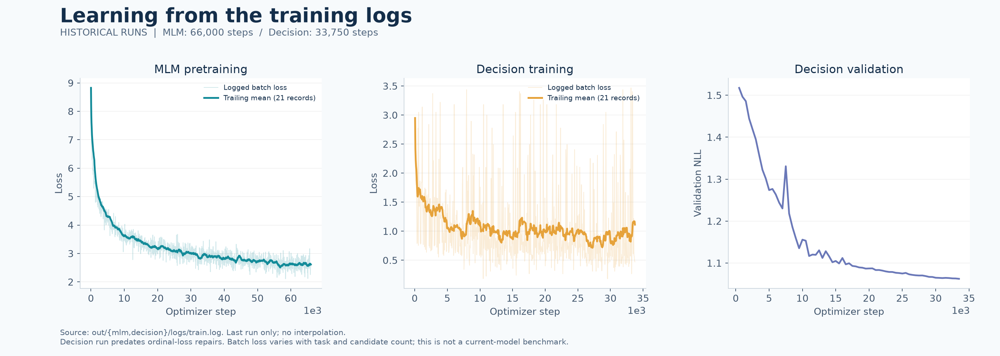
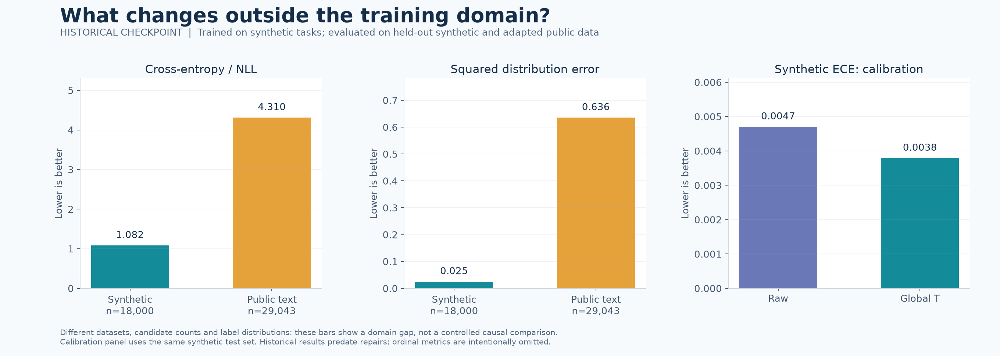
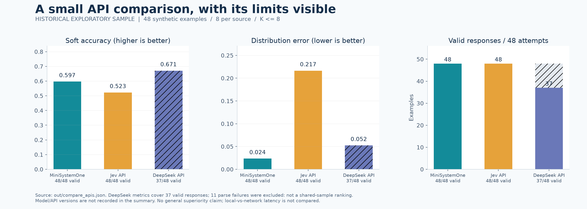

<div align="center">

# 🚀 MiniSystemOne

### Build a small decision model from scratch on a consumer GPU

[中文](README_zh.md) | **English**

⚡ [Quick start](#quick-start) · 🚀 [Your first task](#first-task) · 📚 [Datasets](#datasets) · 🛠️ [Training walkthrough](#training) · 📉 [Training losses](#loss) · 📊 [Evaluation](#evaluation)

</div>



---

## 🌱 Introduction

Give a model some context, a question, and a set of candidates, and get a probability for each option. That is the model MiniSystemOne teaches you to build.

For example, a customer asks to check their balance. Your application must choose between a balance lookup, a transfer workflow, and human review. Beyond calling an API, we want to understand how text becomes tokens, how an encoder reads evidence, how candidates receive scores, how probabilities are learned, and how to check whether those probabilities are reliable.

Inspired by the teaching approach of [MiniMind](https://github.com/jingyaogong/minimind), this project takes beginners from a new BPE vocabulary and a randomly initialized encoder through **data preparation → MLM pretraining → decision training → temperature calibration → evaluation → application integration**. The default decision model has approximately **26.89M parameters**, with training loops written directly in PyTorch.

The model interface is inspired by Jev / System One. This is an independent educational implementation, not a reproduction of Jev's internal architecture or RLCD training method. Training is supervised and does not use Jev outputs as training data.

### 🎓 What you will learn

- Train a tokenizer and understand vocabulary, special tokens, and sequence packing.
- Build a shared encoder that handles different decisions through candidate scoring.
- Generate traceable target distributions and distinguish hard labels, soft targets, and human disagreement.
- Read and modify MLM, cross-entropy, Brier, and ordinal losses.
- Separate training, validation, calibration, held-out evaluation, and cross-task evaluation.
- Train on your own task and use probabilities to route requests to automation or human review.

### 🧩 Three question types, one model

| Primitive | Example use | Output |
|---|---|---|
| **Noul** | Does this satisfy a condition or pass a check? | `P(yes)` and `P(no)` |
| **Choice** | Which tool, intent, or action should be selected? | Distribution over 2–255 dynamic candidates |
| **Score** | What rating or execution-quality level applies? | Distribution over 2–10 levels and an expected score |

All three share one encoder and one candidate-scoring head. The model does not generate an answer token by token: the packed path scores candidates in parallel, while large candidate sets can be processed in chunks. Python assembles the output JSON.

> **Current status:** the minimal training pipeline, inference interface, and regression tests have been exercised. Older weights and historical plots used the ordinal loss before its correction; updated full-model results require retraining, calibration, and evaluation. Old numbers are not presented as current results here. The repository does not include `.pth` weights; start by training the small model below.

<a id="quick-start"></a>
## ⚡ I · Quick start: run the complete pipeline

### 1. Set up the environment

Training requires an NVIDIA CUDA GPU. Inference and basic tests also support CPU. Historical runs used a single RTX 4070 Laptop GPU with 8GB VRAM, but memory use and speed depend on batch size, sequence length, and candidate count.

```shell
git clone https://github.com/Colvin0315/MiniSystemOne.git
cd MiniSystemOne
conda create -n minisystemone python=3.12 -y
conda activate minisystemone
python -m pip install torch==2.6.0+cu124 --index-url https://download.pytorch.org/whl/cu124
python -m pip install -r requirements.txt
python -c "import torch; print('CUDA available:', torch.cuda.is_available())"
```

Run every command from the repository root. Commands use single lines for PowerShell and Bash. Confirm CUDA is `True` before training. Full training defaults to `hidden_size=512` and `num_hidden_layers=8`; this quick start uses a smaller `128 × 2` model.

### 2. Train a small model from scratch

This route uses generated data only: no external corpus download or separate MiniMind checkout is needed. All artifacts go under `out/quickstart/`. Use a fresh output directory to avoid overwriting an existing run.

For the one-command offline workflow, see [scripts/quickstart.py](scripts/quickstart.py). For a guided custom-task walkthrough, see [Your first task](docs/FIRST_TASK.md).

**The purpose is to understand and verify the pipeline. A few training steps do not establish task competence.**

**🔤 ① Train your tokenizer**

```shell
python trainer/train_tokenizer.py --synthetic_only --n_docs 0 --n_synth 200 --out_dir out/quickstart/tokenizer --skip_eval
```

This produces `tokenizer.json` and `tokenizer_config.json`. Both `train_tokenizer.py` and `train_mlm.py` require `--synthetic_only` for synthetic-only training; empty `--pretrain_path=` and `--en_path=` no longer explicitly disable corpus sources. For training with external text, omit `--synthetic_only` and provide valid local corpus paths; missing files are errors, not a fallback to synthetic-only training. `--skip_eval` skips the compression check for this tiny demonstration.

**🧩 ② Generate decision data**

```shell
python scripts/build_dataset.py --tokenizer out/quickstart/tokenizer --out out/quickstart/data --per_gen_train 20 --per_gen_val 4 --per_gen_calib 4 --per_gen_test_known 4 --per_gen_test_ood 4
```

The six generators produce 120 training examples and 24 examples each for validation, calibration, and known-task testing. No entire generator is held out by default, so `test_ood` is empty. Setting `--per_gen_test_ood` alone does not create an OOD task.

**🧠 ③ Pretrain text representations with MLM**

```shell
python trainer/train_mlm.py --tokenizer out/quickstart/tokenizer --synthetic_only --n_docs 0 --n_synth 40 --hidden_size 128 --num_hidden_layers 2 --max_len 256 --batch_size 2 --epochs 1 --max_steps 5 --save_optimizer --no_swanlab --out out/quickstart/mlm --log_dir out/quickstart/mlm/logs
```

**🎯 ④ Learn candidate probabilities**

```shell
python trainer/train_decision.py --tokenizer out/quickstart/tokenizer --data out/quickstart/data --encoder out/quickstart/mlm/mlm.pth --hidden_size 128 --num_hidden_layers 2 --batch_size 2 --epochs 1 --max_steps 5 --val_limit 12 --val_every 0 --save_optimizer --no_swanlab --out out/quickstart/decision --log_dir out/quickstart/decision/logs
```

**📊 ⑤ Calibrate and evaluate on separate data**

```shell
python trainer/calibrate_temperature.py --tokenizer out/quickstart/tokenizer --ckpt out/quickstart/decision/decision.pth --data out/quickstart/data --hidden_size 128 --num_hidden_layers 2 --batch_size 2 --lbfgs_steps 10 --out out/quickstart/calibration
python eval/eval_harness.py --tokenizer out/quickstart/tokenizer --ckpt out/quickstart/decision/decision.pth --data out/quickstart/data --hidden_size 128 --num_hidden_layers 2 --batch_size 2 --sets test_known --out out/quickstart/eval
```

The second command reports uncalibrated results. Add `--temperature out/quickstart/calibration/T.json` to compare temperature-scaled results alongside them. This tiny calibration set is only a demonstration.

**🚀 ⑥ Submit a question**

```shell
python scripts/decide.py --tokenizer out/quickstart/tokenizer --ckpt out/quickstart/decision/decision.pth --input examples/choice.json --device cpu
```

You have now followed the path from a vocabulary and random weights to a decision output. Inspect the artifacts to connect each stage with its code:

| Path | Contents |
|---|---|
| `out/quickstart/tokenizer/` | Newly trained vocabulary |
| `out/quickstart/data/` | Data splits and build manifest |
| `out/quickstart/mlm/mlm.pth` | Pretrained encoder |
| `out/quickstart/decision/decision.pth` | Decision model |
| `out/quickstart/decision/decision_opt.pth` | Complete resume state |
| `out/quickstart/calibration/T.json` | Temperatures and matching checkpoint/tokenizer hashes |
| `out/quickstart/eval/decision/data_test_known.json` | Metrics and per-example results |

<a id="first-task"></a>
## 🚀 II · Use the model for your first task

Our example routes a customer request to an appropriate tool. The model selects an option; application code handles the next step.

### 1. Describe the state, question, and candidates

Edit [examples/choice.json](examples/choice.json):

```json
{
  "state": "The user asks to check their account balance. Available tools: balance_lookup retrieves the balance; transfer_funds moves money.",
  "question": "Which tool matches the user's request?",
  "primitive": "choice",
  "candidates": ["balance_lookup", "transfer_funds", "abstain"]
}
```

Put the evidence in `state`, the decision to make in `question`, and the allowed options in `candidates`. Candidates may change between requests, but adding a name does not automatically teach the model a new business rule.

### 2. Call the model and use its output

Save this as `route_demo.py` in the repository root and run `python route_demo.py`. It uses the quick-start artifacts; replace them with weights trained and evaluated on your task for actual use.

```python
import json
from model.inference import DecisionPredictor

predictor = DecisionPredictor(
    checkpoint="out/quickstart/decision/decision.pth",
    tokenizer="out/quickstart/tokenizer",
    device="cpu",
)
with open("examples/choice.json", encoding="utf-8") as f:
    request = json.load(f)

result = predictor.predict(request)
print(json.dumps(result, ensure_ascii=False, indent=2))

# 0.8 is illustrative; select a threshold on your validation set.
choice = result["choice"]
if result["confidence"] < 0.8 or choice == "abstain":
    destination = "human review"
else:
    destination = {
        "balance_lookup": "balance lookup workflow",
        "transfer_funds": "transfer request workflow",
    }[choice]
print("Route request to:", destination)
```

The output includes candidate `probabilities`, the highest-probability `choice`, its `confidence`, and `state_truncated` and `temperature_applied`. This program makes a routing decision; it does not invoke a banking API.

Two Python entry points are available: [model/inference.py](model/inference.py) provides the single-question `DecisionPredictor` shown above; root-level [inference.py](inference.py) provides the typed interface.

### 3. Answer the other two question types



These are actual outputs from the repaired quick-start model on the three repository examples. After only five training steps per stage, probabilities remain near uniform. The Choice request goes to human review because confidence is below the illustrative 0.8 threshold. This demonstrates the interface and fallback, not task competence.

```shell
python scripts/decide.py --tokenizer out/quickstart/tokenizer --ckpt out/quickstart/decision/decision.pth --input examples/noul.json --device cpu
python scripts/decide.py --tokenizer out/quickstart/tokenizer --ckpt out/quickstart/decision/decision.pth --input examples/score.json --device cpu
```

- **Noul:** supply `state`, `question`, and `primitive: "noul"`. Candidates are fixed to `yes/no`; output also includes `p_true`.
- **Score:** supply candidate texts and matching `levels`, such as `[3, 1, 2]`. Output also includes `expected_score = Σ p_i × level_i`.

Inference keeps at most 512 state tokens by default, with at most 128 tokens for the question and for each candidate. State truncation is flagged in the output. Adjust the context budget and candidate chunk size with `--max_state_tokens` and `--chunk`. Load matching temperatures with `--calibration T.json`; calibration evidence applies to the evaluated domain, not automatically to every task.

<a id="datasets"></a>
## 📚 III · Datasets: what the model learns from

The project uses three layers of data: **language pretraining corpora, synthetic decision data, and public real-text datasets**. They serve different purposes.

### 1. Language pretraining corpora

| Data | Purpose | Local file |
|---|---|---|
| MiniMind `pretrain_t2t_mini.jsonl` or your own Chinese text | Chinese representations and vocabulary | This guide uses `dataset/pretrain_zh.jsonl` |
| `tatsu-lab/alpaca` | English instruction/conversation phrasing; concatenate instruction/input/output as plain text | `dataset/pretrain_en_alpaca.jsonl` |
| `Salesforce/wikitext`, `wikitext-103-raw-v1` | Additional English text | `dataset/pretrain_en_wiki.jsonl` |
| Rendered synthetic task text | Tool names, grades, amounts, and domain terms | Generated during corpus construction |

Pretraining input contains one document per line, for example `{"text": "The account has passed identity verification."}`. There are no candidate-selection labels at this stage: the tokenizer learns segmentation and MLM learns to recover masked tokens. Using Alpaca text here does not make this conversational SFT.

### 2. Six synthetic decision tasks

Rule-based programs in [dataset/synth/](dataset/synth/) generate Chinese, English, and mixed-language examples. Target probabilities come from explicit generative rules, rather than invented confidence values.

| Generator | Task | Primitive | Target source |
|---|---|---|---|
| `banking_balance` | Read balances, amounts, and fees to approve or route | Noul / Choice | Known random rule |
| `tool_router` | Match a request to a tool | Choice | Unique answer or tied valid answers |
| `agent_trace_score` | Rate an execution trace | Score | Marginalization over partially observed quantities |
| `security_gate` | Allow, review, or deny based on risk evidence | Choice | Marginalization or tied answers |
| `refund_policy` | Combine priors and verification evidence for a refund decision | Noul | Known probability rule or marginalization |
| `calendar_slot` | Choose among available time slots | Choice | Known random selection rule |

Default full-build splits can be checked against the [manifest](dataset/synth/manifest.json):

| Split | Examples | Purpose |
|---|---:|---|
| `train` | 180,000 | Update model weights |
| `val` | 6,000 | Monitor training and select settings |
| `calib` | 6,000 | Fit temperatures after freezing the model |
| `test_known` | 18,000 | Held-out templates or entity pools within the same task families |
| `test_ood` | 0 by default | Available only when entire generators are held out |

Splitting operates on `template_id × entity_pool` combinations. `test_known` holds out templates or entity pools; `val/calib` use combinations disjoint from training. This reduces the opportunity to score well by memorizing similar sentences.

### 3. Anatomy of a training example

Training JSONL uses candidate objects with metadata. Inference JSON uses a list of candidate strings. They serve different purposes. Every decision-data row must include `split` matching its file (for example, `"split": "train"` in `train.jsonl`); missing or mismatched values are errors.

```json
{
  "id": "my_router::train::000001",
  "source": "custom:router",
  "gen_version": "1.0.0",
  "split": "train",
  "state": "The user wants to check their account balance.",
  "question": "Which tool should be called?",
  "schema": {"primitive": "choice", "name": "customer_router"},
  "candidates": [
    {"text": "balance_lookup", "label": "balance"},
    {"text": "transfer_funds", "label": "transfer"},
    {"text": "abstain", "label": "abstain"}
  ],
  "target": {"kind": "hard", "p": [1.0, 0.0, 0.0], "provenance": "hard"}
}
```

`target.p` follows candidate order and sums to 1. Reordering candidates requires reordering targets too. For Score, each candidate also needs its actual numeric grade in `meta.level`. Sorting and distance calculations use that grade, not its position in the list.

Hard labels are valid signals for probability learning. Known soft distributions make prediction-to-target distribution comparisons more direct. Do not arbitrarily turn a hard label into 0.8 to manufacture calibration. See the [data schema](docs/DATA_SCHEMA.md) for the complete contract.

### 4. Public real-text datasets and evaluation

[dataset/adapters/](dataset/adapters/) converts public data into this format using project-specific candidates and splits. Results are therefore not directly comparable to original benchmark leaderboards.

| Source | Adapted task | What it probes |
|---|---|---|
| `metaeval/chaos-mnli-ambiguity` | Three-way NLI with annotator distributions | Probability prediction under real human disagreement |
| `clinc/clinc_oos` (plus) | Intent selection, including out-of-scope handling | Real requests and larger candidate sets |
| `PolyAI/banking77` | Banking intent selection | Transfer to business-language classification |
| `google-research-datasets/go_emotions` (raw) | Emotion vote distributions | Disagreement among a small number of annotators |
| `SetFit/amazon_reviews_multi_en` | Ordinal ratings from one to five stars | Rating prediction from real text |

Three details matter: GoEmotions multi-label votes are normalized into distributions, retaining examples with at least two voted emotions, so this is not the original 28-class evaluation; the Amazon adapter reads only validation/test; default decision training reads only `dataset/synth`. **Building public data does not automatically add it to training.**

Public adapters prefer native splits and carve out calibration data according to their rules. Sources without suitable native splits use stable hash buckets. Check the generated `manifest.json` for actual counts.

<a id="training"></a>
## 🛠️ IV · Build and train step by step

This section uses the default 26.89M configuration. New tokenizers, datasets, and weights live under `out/full/`, separate from the bundled tokenizer and older runs.

### 📚 Step 1 · Prepare language corpora

Download `pretrain_t2t_mini.jsonl` from the [MiniMind dataset](https://huggingface.co/datasets/jingyaogong/minimind_dataset/tree/main) and save it as `dataset/pretrain_zh.jsonl`, or provide your own `{"text": ...}` JSONL. Then prepare English data:

```shell
python dataset/pretrain_corpus.py fetch --out dataset/pretrain_en_alpaca.jsonl --dataset tatsu-lab/alpaca --fields instruction,input,output
python dataset/pretrain_corpus.py fetch --out dataset/pretrain_en_wiki.jsonl --dataset Salesforce/wikitext --config wikitext-103-raw-v1 --fields text --strip_wiki_title --min_chars 600 --n_docs 60000
python dataset/pretrain_corpus.py blend --out dataset/pretrain_en.jsonl
```

Downloads need network access; subsequent training reads local files. External datasets retain their own licenses. Passing the Chinese path explicitly avoids depending on the script's original `../minimind/...` default.

### 🔤 Step 2 · Train a BPE vocabulary

```shell
python trainer/train_tokenizer.py --pretrain_path dataset/pretrain_zh.jsonl --en_path dataset/pretrain_en.jsonl --out_dir out/full/tokenizer
```

The target vocabulary size is 6,400, including special tokens such as `<pad>`, `<sep>`, `<mask>`, and `<trunc>`. Tool names and numeric formats also enter tokenizer training. The script checks compression; after changing the tokenizer, rebuild data and train a matching model.

### 🔎 Step 3 · Generate and audit decision data

```shell
python scripts/build_dataset.py --tokenizer out/full/tokenizer --out out/full/synth
python scripts/audit_leakage.py --data out/full/synth
python scripts/audit_synthetic.py --data out/full/synth
```

Audits check positional shortcuts, split separation, whether targets can be recovered from rendered evidence, and lexical baselines. Before model training, the lexical comparison reports only its baseline. Supply `--model_eval` after training to compare model results.

### 🧠 Step 4 · Build the shared encoder

Start with [model/model_system_one.py](model/model_system_one.py) and [model/serialize.py](model/serialize.py). Follow this data path:

```text
state + question + candidates
             │
        BPE tokenizer
             │
[state] [SEP] [question] [SEP] [candidate 1] [SEP] ...
             │
    Shared Transformer encoder
     ├─ Pool state + question → z
     └─ Pool each candidate   → c_i
             │
      Shared scorer f(z, c_i)
             │
       softmax(logits) → p
```

The encoder uses RMSNorm, RoPE, SwiGLU, and grouped-query attention. Attention is constrained: state attends to state; question attends to state and itself; each candidate attends to the prefix and itself, but not other candidates. This enables prefix caching and makes each candidate's score independent of its presentation order.

Check the default parameter count:

```shell
python scripts/model_stats.py --tier 26m
```

Noul has two candidates, Choice has a dynamic candidate set, and Score adds numeric levels. There is no need for three separate classifiers.

### 🔥 Step 5 · Pretrain the encoder with MLM

```shell
python trainer/train_mlm.py --tokenizer out/full/tokenizer --pretrain_path dataset/pretrain_zh.jsonl --en_path dataset/pretrain_en.jsonl --out out/full/mlm --log_dir out/full/mlm/logs --save_optimizer --no_swanlab
```

This stage starts from random weights. The temporary MLM output head shares weights with the token embedding and learns to recover selected text positions. Its `mlm.pth` initializes the next stage's encoder.

### 🎯 Step 6 · Train the decision head and encoder

```shell
python trainer/train_decision.py --tokenizer out/full/tokenizer --data out/full/synth --encoder out/full/mlm/mlm.pth --out out/full/decision --log_dir out/full/decision/logs --save_optimizer --no_swanlab
```

Load the pretrained encoder, initialize a new decision head, and **update both together**. Training defaults to a candidate sampling cap of 32. Score keeps all levels, and evaluation uses all candidates. Batching groups examples by candidate count and length to reduce padding.

| Parameter | MLM default | Decision default | Meaning |
|---|---:|---:|---|
| `hidden_size` / `num_hidden_layers` | 512 / 8 | 512 / 8 | Must match across stages |
| `batch_size` | 16 | 16 | Reduce first if VRAM is tight |
| `max_len` | 512 | 1024 | Decision inputs also contain questions and candidates |
| `epochs` | 8 | 3 | Complete passes through the dataset |
| `learning_rate` | 0.001 | 0.0005 | With warmup and cosine decay |
| `accum` | 1 | 1 | Microbatches per accumulated update |

`--use_checkpoint` trades compute for activation memory. Increasing `--accum` can compensate for a smaller batch size, but does not guarantee identical behavior. Check each script's `--help` for other options.

### 💾 Step 7 · Save and resume

Regular `.pth` files store inference weights, model configuration, and metadata. With `--save_optimizer`, separate `*_opt.pth` files also store the optimizer, scaler, epoch, next batch position, and random states.

Resume the default decision run above:

```shell
python trainer/train_decision.py --tokenizer out/full/tokenizer --data out/full/synth --resume out/full/decision/decision_opt.pth --out out/full/decision --log_dir out/full/decision/logs --save_optimizer --no_swanlab
```

Keep the same training-code version, data, tokenizer, training settings, and total `epochs`. `--max_steps N` fixes the total optimizer-step budget and learning-rate horizon; keep it unchanged on resume, rather than removing or increasing it. Use `--stop_after_steps` for a temporary pause; this pause option may be removed on resume without changing the budget. The five-step quick start therefore has a completed five-step budget, not a longer run waiting to resume. MLM also supports `--resume`. Do not combine `--resume` with a nonempty `--encoder` or `--init_checkpoint`; remove initialization arguments from the resumed command. Old-version checkpoints are for weight initialization only, with a new optimizer and schedule, not exact resume; incomplete or incompatible resume states are rejected.

<a id="loss"></a>
## 📉 V · What losses are we training?

### Start with actual training curves



These plots read historical training logs: MLM reaches 66,000 steps and decision training reaches 33,750. Faint lines show logged batch losses; bold lines show trailing means over 21 records. The right panel shows validation NLL. A restart in the log is separated out, retaining only the final run. Task and candidate-count differences cause loss fluctuations, so a downward training curve alone does not establish generalization.

**The decision run predates the ordinal-loss repair. It is a historical process record, not a benchmark for the current code.** The [numeric snapshot and plotting notes](assets/readme/README.md) are included in the repository. The following formulas describe the current implementation.

### 1. MLM: recover masked tokens

MLM applies span masking to approximately 15% of positions. Of selected positions, approximately 80% become `<mask>`, 10% become random tokens, and 10% stay unchanged. Special tokens are excluded.

$$
\mathcal L_{\mathrm{MLM}}=-\frac{1}{|M|}\sum_{j\in M}\log P_\theta(x_j\mid\widetilde{x})
$$

Here $M$ is the selected position set and $\widetilde{x}$ is the corrupted input. Cross-entropy is computed only at those positions. This teaches contextual representations, not business decisions.

### 2. Decision training: learn the candidate distribution

Let $p$ be the prediction, $t$ the target, and $K$ the number of candidates:

$$
\mathcal L_{\mathrm{CE}}=-\sum_{i=1}^{K}t_i\log p_i,\qquad
\mathcal L_{\mathrm{Brier}}=\sum_{i=1}^{K}(p_i-t_i)^2
$$

- **CE:** assign probability mass to candidates supported by the target.
- **Brier:** penalize squared differences between predicted and target distributions. It is not divided by K by default; `--brier_normalize` enables that comparison.
- **Ordinal term:** only for Score. It uses distances between grades, distinguishing a one-level error from a four-level error.

For Score, first sort actual grades as $l_1<\cdots<l_K$ and form cumulative probabilities $F_p(j)=\sum_{i\le j}p_i$:

$$
\mathcal L_{\mathrm{ord}}=
\frac{\sum_{j=1}^{K-1}(l_{j+1}-l_j)\,[F_p(j)-F_t(j)]^2}
{l_K-l_1}
$$

Candidates may appear in shuffled order; the ordinal term still sorts by `meta.level` and excludes padding. The batch objective is:

$$
\mathcal L=\operatorname{mean}_{B}(\mathcal L_{\mathrm{CE}})
+0.5\operatorname{mean}_{B}(\mathcal L_{\mathrm{Brier}})
+0.5\operatorname{mean}_{B_{\mathrm{Score}}}(\mathcal L_{\mathrm{ord}})
$$

Omit the final term when a batch contains no Score examples. Set the weights with `--lambda_brier` and `--lambda_ord`.

**A useful distinction:** hard-label cross-entropy and Brier can also learn conditional probabilities. Soft targets make distribution errors easier to inspect here; they do not guarantee calibration. Evaluation reports squared distribution distance as `distribution_l2`, and `expected_brier` adds $1-\sum_i t_i^2$ per example before averaging. Both coincide with observed-label Brier for one-hot targets. Training options and the internal loss logger retain the name `brier`; evaluation has no old `brier` alias. See [calibration notes](docs/CALIBRATION.md).

### 3. Temperature calibration: adjust probability sharpness

Freeze the model and fit a positive temperature $T$ by minimizing NLL on the separate `calib` split:

$$
p_i^{(T)}=\operatorname{softmax}(z/T)_i
$$

$T>1$ makes distributions flatter; $T<1$ makes them sharper. The script compares global, per-primitive, and primitive×candidate-count temperatures. Temperature scaling does not correct candidate rankings or replace learning the task.

<a id="evaluation"></a>
## 📊 VI · Evaluation: correct, or merely confident?

### Existing experiments: look at the gap first



The historical model performs better on synthetic held-out data, while NLL and distribution error increase on public real text. These datasets differ in tasks, candidate counts, and target distributions, so this is not a controlled comparison. It illustrates why synthetic results do not establish real-task competence. The right panel compares ECE before and after calibration on the same synthetic test set; lower ECE does not imply higher accuracy.

<details>
<summary><b>Expand: historical small-sample comparison with Jev / DeepSeek APIs</b></summary>



This experiment sampled 8 examples per synthetic task, 48 total, with at most 8 candidates. MiniSystemOne and Jev each returned 48 valid outputs. DeepSeek returned 37 valid outputs, with 11 parse failures excluded from quality metrics. These bars are not a shared-sample fair ranking and do not support a broad superiority claim. The summary does not record API model versions; local inference and network latency are not directly compared in the figure.

</details>

These are historical experiments from before the repairs; full evaluation of a retrained model remains outstanding. All experimental charts are plotted programmatically from records. The header illustration is AI-generated and conceptual. Run `python scripts/make_readme_figures.py` to redraw from the committed numeric snapshot; see [sources and the image-generation prompt](assets/readme/README.md).

### 1. Calibration and synthetic held-out testing

```shell
python trainer/calibrate_temperature.py --tokenizer out/full/tokenizer --ckpt out/full/decision/decision.pth --data out/full/synth --out out/full/calibration
python eval/eval_harness.py --tokenizer out/full/tokenizer --ckpt out/full/decision/decision.pth --data out/full/synth --sets test_known --temperature out/full/calibration/T.json --out out/full/eval
python eval/make_reliability_plot.py --eval out/full/eval/decision --sets test_known --out out/full/plots
```

If VRAM is limited, add `--batch_size 2` to the first two commands. Report filenames contain the dataset directory name, for example `out/full/eval/decision/synth_test_known.json`.

| Metric | Question | Interpretation |
|---|---|---|
| `accuracy` | Does the prediction match the target argmax? | Ties in soft targets depend on tie-breaking |
| `accuracy_soft` | What target probability does the selected candidate receive? | Accuracy for hard labels; expected correctness for soft targets |
| `nll` | Is enough probability assigned to target-supported answers? | Lower is better |
| `distribution_l2` | How far is the prediction from the target distribution? | Sum of squared differences over valid candidates, averaged across examples |
| `expected_brier` | What is the expected observed-label Brier under the given target? | `distribution_l2` plus the mean of $1-\sum_i t_i^2$; identical for one-hot targets |
| `ece` | Does confidence match correctness within bins? | Lower is better, but insufficient alone |
| `ordinal_mae` | How far must rating probability mass move to match the target? | Wasserstein-1 distance in grade units |
| `expected_score_mae` | How large is the expected-rating error? | Score only |

Inspect results by `source` and `provenance` before aggregates. Current output reports `all`, provenance groups, and `soft_targets` for the four non-`hard` provenances (omitted when identical to `all`). This grouping does not exclude hard labels from calibration evaluation. Old `brier` and `calibration` output aliases are not retained; historical figures may still use the old names.

### 2. Test on real text

```shell
python scripts/build_dataset.py --public --tokenizer out/full/tokenizer --out out/full/public
python eval/eval_harness.py --tokenizer out/full/tokenizer --ckpt out/full/decision/decision.pth --data out/full/public --sets test_known --batch_size 2 --out out/full/eval_public
python eval/make_reliability_plot.py --eval out/full/eval_public/decision --sets test_known --source public:chaosnli --out out/full/plots_public
```

Report raw probabilities first instead of automatically applying temperatures fitted on synthetic data. Although named `test_known`, the public split is a cross-domain test for a model trained only on synthetic tasks. If continuing training on public data, retain independent calibration and test sets and disclose the changed training sources.

### 3. Test unseen task families

```shell
python scripts/build_dataset.py --tokenizer out/full/tokenizer --out out/full/synth_ood --ood_generators calendar_slot security_gate
```

This reserves those entire generators for `test_ood`. For a task-family generalization experiment, **retrain the decision model** on `out/full/synth_ood/train.jsonl`, then evaluate its `test_ood`. A full-data model already trained on those generators cannot establish this claim. To claim the entire pipeline never saw these tasks, exclude them from tokenizer/MLM corpora too; default synthetic pretraining text does not provide that isolation.

### 4. Speed, memory, and code correctness

```shell
python eval/eval_efficiency.py --tokenizer out/full/tokenizer --ckpt out/full/decision/decision.pth --data out/full/synth --out out/full/efficiency
python -m unittest discover -s tests -v
python scripts/smoke_test.py --device cpu --skip_big
```

Read efficiency separately from task quality. Candidate count, state length, batch size, tokenization, and packing affect end-to-end latency. Architecture tests cover candidate permutation, chunking, and prefix isolation; regression tests cover ordinal calculations, truncation, abstention, inference, and resuming. See the [detailed quick start](docs/QUICKSTART.md) for GPU resume-equivalence tests: `test_resume.py` runs automatically when CUDA is available, while `test_training_integration.py` additionally requires `MINISYSTEMONE_GPU_TESTS=1`.

<a id="custom-task"></a>
## 🎯 VII · Train on your own task

For a customer-support tool router:

1. **Define the choices.** Specify each option and when human review applies. Model independent judgments that can both be true as separate Noul questions.
2. **Prepare examples.** Record real requests, candidates, and labels in the JSONL format above. Include varied phrasing, missing information, and easily confused requests.
3. **Separate the data.** Create `train.jsonl`, `val.jsonl`, `calib.jsonl`, and `test_known.jsonl` under `dataset/my_task/`. Split by conversation, user, or template to avoid paraphrase leakage.
4. **Train and evaluate.** Inspect validation errors, fit temperatures on calibration data, then report final results on the test set.
5. **Connect the application.** Call `DecisionPredictor` with consistent candidate names. Choose routing thresholds on validation data and track coverage and error rate.

Using the encoder and tokenizer from the full walkthrough:

```shell
python trainer/train_decision.py --tokenizer out/full/tokenizer --data dataset/my_task --encoder out/full/mlm/mlm.pth --out out/my_task --log_dir out/my_task/logs --save_optimizer --no_swanlab
python trainer/calibrate_temperature.py --tokenizer out/full/tokenizer --data dataset/my_task --ckpt out/my_task/decision.pth --out out/my_task/calibration
python eval/eval_harness.py --tokenizer out/full/tokenizer --data dataset/my_task --ckpt out/my_task/decision.pth --sets test_known --temperature out/my_task/calibration/T.json --out out/my_task/eval
```

In the routing example, set the checkpoint to `out/my_task/decision.pth` and tokenizer to `out/full/tokenizer`. To apply its temperatures, construct `DecisionPredictor` with `calibration="out/my_task/calibration/T.json"`.

<a id="code-map"></a>
## 🧭 VIII · Suggested code-reading order

| Order | File | Start by understanding |
|---:|---|---|
| 1 | [train_tokenizer.py](trainer/train_tokenizer.py) | How text becomes tokens |
| 2 | [serialize.py](model/serialize.py) | Input layout, segments, masks, and candidate spans |
| 3 | [model_system_one.py](model/model_system_one.py) | Encoder, pooling, scoring, and losses |
| 4 | [decision_dataset.py](dataset/decision_dataset.py) | Truncation, candidate sampling, and batching |
| 5 | [train_mlm.py](trainer/train_mlm.py) / [train_decision.py](trainer/train_decision.py) | Optimizers and training loops |
| 6 | [eval_metrics.py](eval/eval_metrics.py) / [calibrate_temperature.py](trainer/calibrate_temperature.py) | Measuring probabilities and calibrating them |
| 7 | [inference.py](model/inference.py) / [decide.py](scripts/decide.py) | Connecting the model to a task |

Further reading: [architecture](docs/DESIGN.md) · [data schema](docs/DATA_SCHEMA.md) · [calibration](docs/CALIBRATION.md) · [detailed quick start](docs/QUICKSTART.md).

## 💡 FAQ

**Can it answer arbitrary questions like a chat model?** No. Its scope is contextual decisions over candidates, and its capabilities depend on training data. Valid probabilities and valid output formatting do not establish correctness.

**Why use MLM first?** It supplies text representations. Use `--encoder=` to train decisions from random weights as an ablation of pretraining's value, rather than assuming pretraining always helps.

**Can I train on CPU?** Both current training entry points require CUDA. CPU supports inference, parameter counting, and basic tests. Start with the small route to check your environment.

**Are there limitations on candidate changes?** Candidates are scored independently by default, which suits checking each option against evidence. Tasks such as choosing the median of the current candidate set require relationships between candidates that this structure cannot directly express.

**How can I reduce VRAM use?** Reduce `--batch_size` first, then consider sequence length and `--use_checkpoint`. On Windows, memory pressure may cause severe slowdown before an OOM error appears.

**I just want to try it quickly.** Generate small weights with the quick start, then run `scripts/decide.py`. If you already have matching trained weights and a tokenizer, call inference directly. Keep tokenizers, weights, and temperatures matched to the same run.

## 🙏 Acknowledgments and license

Thanks to [MiniMind](https://github.com/jingyaogong/minimind) for inspiring accessible training-from-scratch tutorials, and to the public dataset authors. The decision interface draws inspiration from [TypeSafe's Jev introduction](https://typesafe.ai/blog/introducing-system-one-models-and-jev). For probabilistic scoring theory, see [Gneiting and Raftery](https://www.eecs.harvard.edu/cs286r/courses/fall10/papers/Gneiting07.pdf).

Code is licensed under [Apache-2.0](LICENSE). Consult each external dataset for its own license and usage terms.
