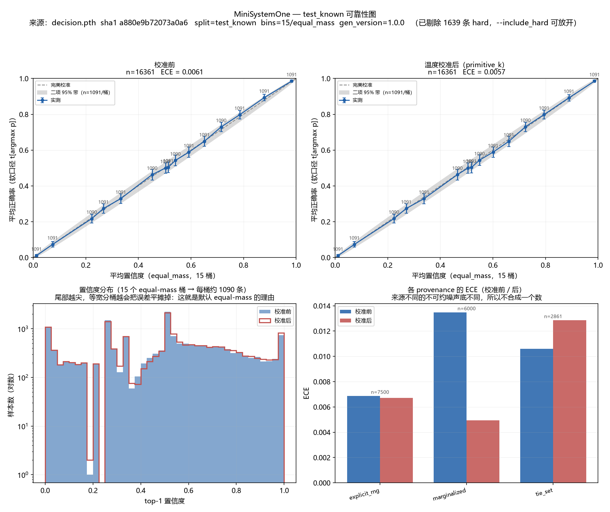
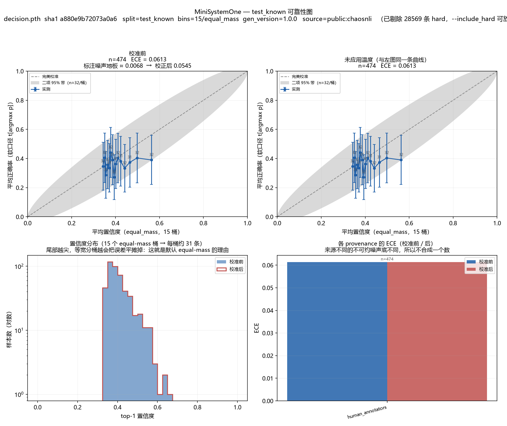

# MiniSystemOne

> **Train a probabilistic decision model from scratch — no LLM, no decoding, no JSON generation.**

A ~27M-parameter model that takes a **state** plus **typed questions** and returns
**typed decisions with candidate probabilities** — in a single parallel forward pass.
Calibration is an empirical property to evaluate, not a guarantee of the architecture.
No autoregressive loop, no text output, no constrained-decoding tricks.

Built from random initialization, MiniMind-style: one shared bidirectional encoder,
one decision head, one loss. Historical full-scale measurements below used a single
8 GB laptop GPU and the original corpora; they are not quickstart results or a guarantee
for other hardware or replacement datasets.

## Start here: three routes

Run commands from the repository root in the environment from [Reproducing](#reproducing).
Model training/inference uses CUDA (no CPU fallback in the recommended route). There is
**no published weights download URL** here; weights and their matching tokenizer must exist locally.

1. **Use local weights.** If you already ran quickstart, try a label-free request:
   ```bash
   python inference.py --ckpt out/quickstart/decision/decision.pth --tokenizer out/quickstart/tokenizer --input examples/inference/choice.json
   # Optional: apply the matching temperature artifact
   python inference.py --ckpt out/quickstart/decision/decision.pth --tokenizer out/quickstart/tokenizer --input examples/inference/choice.json --temperature out/quickstart/calibration/T.json
   ```
   Replace `choice.json` with `noul.json` or `score.json` for the other primitives.
   Without `--temperature`, output is explicitly uncalibrated. Other local checkpoints
   require their own matching tokenizer and temperature; a CLI JSON response is not
   autoregressive JSON generation by the model.
2. **Train an offline toy model from scratch.** With dependencies installed:
   ```bash
   python scripts/quickstart.py
   ```
   Uses bilingual synthetic train templates, a small h128/L2 model and 20 updates per
   training stage; runs tokenizer → data → MLM → decision → calibration → held-out
   evaluation → three inference examples. Outputs stay in `out/quickstart/`; existing
   outputs are not silently overwritten. It skips the formal tokenizer compression
   gate explicitly, not special-token validation. This teaches the pipeline, **not
   business quality or reproduction of the historical 26.89M tables**.
3. **Reproduce the full experiment.** Follow [Reproducing](#reproducing): acquire the
   natural-language corpora yourself, prepare `dataset/pretrain_zh.jsonl` and
   `dataset/pretrain_en.jsonl`, and run the full stages. Source acquisition is not
   magically done by training commands; replacing the corpus is a new experiment.

Measured quickstart on RTX 4070 Laptop: **90.5 seconds** for all stages, using
[the checked-in configuration](configs/quickstart.json); MLM length 256 and decision
length 2048 retain large candidate sets. Peak allocated training tensors were 0.097 GB
(MLM) / 0.210 GB (decision), **not total device memory**. The 96-row test accuracy was
29.2%; this is pipeline evidence, not business quality. See [measured results](results/quickstart.json).
No other GPU memory tiers were tested.

Next: [Your first custom task](docs/FIRST_TASK.md), a customer-service tool router with
human handoff. A new schema/candidate list does not mean a new task has been learned.
Under default independent scoring, at fixed state/question and temperature,
`p_i/p_j = exp((s_i-s_j)/T)` does not depend on other candidates: adding one changes
normalization, not the old pairwise ratio. That limits set-dependent reasoning.
Low binned ECE is neither per-request correctness nor an OOD safety guarantee.


---

## What a "System One" model is

On 2026-09-15 TypeSafe AI released **Jev**, the first "System One Model" — a model that
does not generate text at all. You hand it a **state** (unstructured context) plus a set
of **typed questions**, and it returns **typed decisions with probabilities**, computed in
one parallel forward pass.

Its published properties, from TypeSafe's own documentation:

| Property | Detail |
|---|---|
| **Three primitives** | `Noul` — P(true) for a yes/no question. `Choice` — a distribution over **2–255** dynamically supplied candidates. `Score` — a distribution over 2–10 ordered levels plus an expected score. |
| **One call, many questions** | A 14-question rubric answered in a single request. Their `parallel_questions` cookbook measures one batched call as "**12.2× cheaper and 10.0× faster with no change in answers**". |
| **No decoding** | No autoregressive loop and no JSON to parse, so there is no schema error to handle. |
| **Reproducible** | Over 15 repeats of an identical request, mean per-question probability **σ = 0.0102** — in a setting where LLMs "move from run to run, at temperature 0 too". |
| **Confidence-gated routing** | "The answer tells you *what*; confidence tells you *whether to act*." Threshold the probability to pass / review / block. |
| **Speculative fan-out** | Ask many questions at once — including ones you may not need — and let your code decide what was relevant. |
| **Trained with RLCD** | "Reinforcement Learning for Calibrated Decisions": the training objective is calibration, not next-token likelihood. |

Jev is closed-weight and API-only.

### What this repository is

**MiniSystemOne is a from-scratch, educational reimplementation of that idea** — the same
relationship MiniMind has to the LLaMA/GPT recipe, applied to decision models instead of
chat models.

- **From random initialization.** Every other open replica of Jev continues from an
  existing LLM (Qwen3-0.6B, Gemma, …). This one starts from nothing: a new BPE, an
  MLM-pretrained encoder, then a decision head. Whole chain is **26.89M parameters and
  4.7 hours on one 8 GB laptop GPU** — tokenizer, pretraining, decision training and
  calibration all in this repository.
- **One encoder, one head, one loss.** Noul, Choice and Score are not three code paths.
  They are one softmax over a candidate set: Noul is `{yes, no}`, Score is `{1..5}`.
  Abstention is a candidate, not a branch.
- **Calibration needs measurement.** Hard-label cross-entropy and Brier are proper
  scoring rules and can learn conditional probabilities in expectation. Soft targets
  are not required; our known synthetic distributions make direct supervision and
  distribution-level checks easier.
- **Honest by construction.** Where this project's own projection turned out wrong
  (per-question amortization, latency), the README says so and strikes it out. Where the
  model fails (real text, OOD), the number is reported rather than buried.

---

## ⚠️ Not a Jev reproduction

This project is an **independent educational implementation**. It is *inspired by*
the "System One Model" idea popularized by TypeSafe AI's Jev (2026-09-15),
the same way [MiniMind](https://github.com/jingyaogong/minimind) is an educational
reimplementation of the LLaMA/GPT recipe rather than a reproduction of any specific
model.

**We do not distill Jev's outputs and we make no attempt to reverse-engineer their
system.** TypeSafe's Master Customer Agreement prohibits exactly that. All training data
here is either program-generated by the synthetic generators in `dataset/synth/` or
derived from public datasets via the adapters in `dataset/adapters/`.
**Nothing flows from Jev into training, and no Jev output is committed to this repo.**

The one place Jev is touched at all is a **benchmark comparison**
(`eval/compare_apis.py`, results [below](#comparison-against-jev-and-a-general-llm)): the
same state, questions and candidate sets are sent to `jev-latest` and to this model, and
only **aggregate** metrics are reported. Benchmarking is not distillation — but it is
a *different* question under the terms, so this will live in a separate, explicitly
opt-in script that requires an API key and sits on no training or data-building path.
Whether the MCA permits it is the account holder's call, not something this repo assumes.

We also **do not claim to beat Jev**, on any axis. See
[Honest boundaries](#honest-boundaries) — the latency figures are not even in the
same unit of measurement.

---

## The idea in one picture

```
state tokens            question tokens      candidate 1   candidate 2   ...
[ ...account data... ]  [ Is this fraud? ]   [fraud]       [legit]       ...
        seg=STATE              seg=QUESTION      seg=CANDIDATE
        └──────────── one bidirectional forward ─────────────┘
                                    │
                       span pool over state ∪ question → z
                                    │
                    per-candidate scorer  f(z, c_i) → logit_i
                                    │
                       softmax over the K candidates → p
```

**Three primitives, one head.** Noul (yes/no), Choice (dynamic candidate set up to
255), and Score (ordinal) are all *the same operation*: a softmax over a candidate
set. Noul is just `{yes, no}`; Score is just `{1, 2, 3, 4, 5}`. There is no separate
sigmoid head, and **abstention is a candidate rather than a branch** — because
abstaining *is* a choice among options.

The design is documented in [`docs/DESIGN.md`](docs/DESIGN.md); the calibration
methodology in [`docs/CALIBRATION.md`](docs/CALIBRATION.md); the frozen data contract
in [`docs/DATA_SCHEMA.md`](docs/DATA_SCHEMA.md).

### Why calibration is the whole point

**Hard labels can teach and evaluate calibration.** The expected cross-entropy and
observed multiclass Brier are minimized at the true conditional distribution. A single
one-hot observation does not reveal that distribution, but empirical learning across
samples can estimate it. Soft labels are convenient, not necessary.

This repo builds directly checkable targets three ways — a known randomized rule
(`explicit_rng`), marginalization over a hidden variable exposed only coarsely in the
state (`marginalized`), and defined tied answer sets (`tie_set`). ChaosNLI's ~100
annotations per item (`human_annotators`) provide empirical frequencies, not guaranteed
true conditional probabilities.

Report the overall population and provenance groups with their composition. Binned
**top-label ECE** compares confidence with mean `t[argmax p]`; it does not prove per-row
distribution accuracy or OOD understanding. See [the metric contract](docs/CALIBRATION.md).
New outputs use `distribution_l2` (mean over samples of the **sum** of classwise squared
differences), `expected_brier = distribution_l2 + mean(1-sum(t**2))`, and `soft_targets`
in place of the old `brier` and `calibration` aggregate. No legacy aliases are emitted.
`ece_annotation_reference` replaces the old noise-floor diagnostic with an explicitly
assumption-dependent MC reference; `ece_corrected` is removed. It must not be subtracted
from ECE. Old tables below retain their actual distances as distribution L2; historical
expected Brier was not measured and is not filled in.

---

## Results

All numbers below are from `out/decision/decision.pth` — 26.89M parameters, MLM-pretrained
from random initialization on 67.6M tokens, then 33,795 decision steps. Peak training VRAM
**3.85 GB**. Reproduce with the commands in [Reproducing](#reproducing).

The external comparison against `jev-latest` and a general LLM is at
[the end of this section](#comparison-against-jev-and-a-general-llm). Nothing here is
estimated.

### Calibration on synthetic held-out data

`test_known`, n=18,000, K up to 255. The `soft_targets` row (historically
`metrics.calibration`) excludes hard targets to describe that subset, not because hard
labels cannot measure calibration. Overall and subgroup metrics answer different questions.

| | acc | ECE | distribution L2 | NLL |
|---|---|---|---|---|
| uncalibrated | 0.647 | 0.0047 | 0.0249 | 1.0821 |
| global temperature | 0.647 | 0.0038 | 0.0249 | 1.0821 |
| per-(primitive × K) temperature | 0.647 | 0.0046 | 0.0248 | 1.0800 |
| **soft_targets subset** (hard excluded, n=16,361) | **0.612** | **0.0061** | 0.0273 | — |



**Temperature has little effect in this historical fit.** `T = 0.965` and NLL moves
1.0629 → 1.0628. This reports a small benefit for this distribution, not proof of
per-row calibration or evidence that one-hot training cannot calibrate.

### Read this table, not the accuracy column

The `accuracy` column is argmax agreement (with a first-index tie rule), not the same
as `accuracy_soft = mean(t[argmax p])`. On `tie_set`, soft correctness is at most `1/k`;
on one-hot targets it is observed accuracy. The table below reports soft correctness
against the target-defined oracle ceiling `mean(max_k t_k)`. Overall scores depend on
composition, so per-source results help interpret them.

| source | n | model | oracle ceiling | achieved |
|---|---|---|---|---|
| `tool_router` | 3,000 | 0.7137 | 0.7140 | **100.0%** |
| `security_gate` | 3,000 | 0.6403 | 0.6426 | **99.6%** |
| `refund_policy` | 3,000 | 0.7561 | 0.7601 | **99.5%** |
| `marginalized` / `agent_trace_score` | 3,000 | 0.6366 | 0.6450 | **98.7%** |
| `banking_balance` (`explicit_rng`) | 3,000 | 0.4544 | 0.6091 | **74.6%** |
| `calendar_slot` | 3,000 | 0.0920 | 0.1416 | **65.0%** |

Four of six generators are essentially solved. The two that are not are the two that
should be hardest, and for different reasons:

- **`banking_balance`** is the arithmetic one — `q = σ((B − A − fees)/τ)` — and it is also
  where calibration is worst (**ECE 0.1637** vs 0.0035–0.0495 elsewhere). A 26M encoder
  cannot do the arithmetic exactly, so it approximates, and its confidence tracks the
  approximation rather than the answer.
- **`calendar_slot`** is the large-K one (K up to 255). Both model and oracle sit near 0.1,
  so this is a genuinely ambiguous task built into the data, not a model failure — but the
  model still only reaches 65% of what is achievable.

### The BoW gate (pre-registered)

The plan requires the model to beat a bag-of-words lexical probe on `test_known` by ≥0.25,
else the generators are declared over-templated and **no model metric may be reported**.
The gate was recorded before any checkpoint existed (0.315 lexical upper bound).

```
真实模型 test_known 准确率 0.647
模型 − 词法上界 = +0.332，门槛 ≥0.25  → 通过
```

Gate **passes**. Note this passes on the pooled `accuracy`; the per-source table above is
the reading that survives scrutiny.

### Calibration on real human disagreement (ChaosNLI)



474 items, N≈100 annotators each. Historical **ECE 0.0613** and annotation MC reference
**0.0068** are retained. The old subtraction **0.0545** is recorded only as a withdrawn
interpretation, **not corrected ECE**. The reference assumes independent annotations and
confidence equal to true top-label probability; it is not a universal noise lower bound.
Old embedded images may retain superseded floor/correction labels; regenerate them with
the current plot script. The right panel applies no temperature and therefore says
nothing about whether synthetic-to-real temperature transfer succeeds.

The pooled `human_annotators` ECE **0.3167** describes its particular mixture, not each
source. Report ChaosNLI and GoEmotions separately as well: GoEmotions has 3–5 annotators,
with historical ECE **0.3253** and MC reference **0.0044**. Mixed metrics are legitimate
when the composition and purpose are explicit; neither MC quantity should be deducted.

### Synthetic → real gap

**0.612 → 0.424 soft-accuracy** (synthetic soft_targets subset → ChaosNLI / GoEmotions on
real text). Roughly **19 points** of accuracy are lost crossing from program-generated rules
to real natural language. Accuracy on the harder public splits — CLINC150, banking77,
Amazon — is 0.157, close to but above chance.

This is the project's most informative single number and it is reported as a limitation,
not a footnote.

### Efficiency — and two projections this project got wrong

Measured on the real per-request path (`model.decide_chunked`), 200 distinct samples,
RTX 4070 Laptop.

| | value |
|---|---|
| latency (B=1, per sample) | **20.24 ms** median, 27.09 ms p95, 17.23–33.23 ms range |
| throughput | 49.4 samples/s |
| median sample | state 87 tok, question 8 tok, 3 candidates |
| peak VRAM | **0.13 GB**, flat across B∈{1,8} × K∈{2,32,128,255} |
| K=255 | 49.97 ms median (chunked path) |

**Latency is overhead-bound, not compute-bound — and that is measurable.** K=2 takes
19.88 ms and K=32 takes 18.37 ms: adding 30 candidates costs *nothing*, because a fixed
per-call cost dominates. That also explains why the 5.87 ms figure quoted during design
(a raw forward on a prepared tensor) does not survive: the real path builds masks,
positions and the packing every call.

**Per-question amortization does not materialize.** The design projected ~3.3× at N=16
from prefix KV reuse. Measured:

| N questions sharing one state | naive | cached | speedup |
|---|---|---|---|
| 1 | 19.07 ms | 25.86 ms | **0.74×** |
| 4 | 78.45 ms | 85.83 ms | 0.91× |
| 16 | 440.04 ms | 423.20 ms | **1.04×** |
| 64 | 1451.66 ms | 1184.07 ms | 1.23× |

Breakdown: `encode_state` 7.31 ms, `encode_prefix` 8.69 ms, full question 19.85 ms. So a
cached question costs 8.69 ms for 11 tokens — the saving is real in the arithmetic but
swamped by the same fixed overhead. **The architectural property is not in doubt** (smoke
test `[D]` shows prefix hidden states are bit-for-bit independent of the candidates, which
is what makes reuse *correct*), but at the sequence lengths this task actually produces
(state ≈ 87 tokens) there is almost nothing to amortize. The amortization claim needs long
states to be worth anything, and this data does not have them.

### Comparison against Jev and a general LLM

`eval/compare_apis.py` — 48 items, stratified across the six generators, candidates ≤ 8,
**the same inputs and the same `eval_metrics.py` scoring all three**.

| system | n | dropped | soft-acc | **ECE** | distribution L2 | **ms/item** | output tokens |
|---|---|---|---|---|---|---|---|
| **ours** | 48 | **0** | 0.5968 | **0.0248** | 0.0235 | **4.3** | **0** |
| `jev-latest` | 48 | 0 | 0.5226 | 0.2164 | 0.2165 | 1464.6 | 2,781 |
| `deepseek-flash` | 37 | **11** | **0.6711** | 0.0538 | 0.0524 | 5650.9 | 139,731 |

**Read the caveats before the numbers.**

- **Ours was trained on this distribution; the other two are zero-shot.** That favours us
  on accuracy — and DeepSeek *still beats us on it* (0.6711 vs 0.5968) while dropping the
  23% of items whose reasoning consumed its budget. This is the boundary stated under
  [Honest boundaries](#honest-boundaries): **we do not claim to win on accuracy.**
- **DeepSeek's 11 empty responses are a budget artifact, not a hard failure.** Its API
  accepts `max_tokens` up to 65536; we set 8192 and the reasoning stage spent all of it.
  It is a latency/cost-versus-reliability trade-off — one our model simply does not face,
  at 4.3 ms and zero output tokens.
- **Jev's ECE here does not contradict TypeSafe's claims.** Their published guarantee is
  run-to-run *stability* (σ = 0.0102 on their own tasks), not agreement with our
  generator's `P*`. Those are different propositions, and this table only measures the
  second one.
- **n = 48, eight per generator.** This shows a shape, not a citable number.

The rendering-sufficiency audit reported `P*` **100% recoverable from rendered text**,
so the inputs expose the intended evidence. On this small historical sample, Jev's
**distribution L2 (squared-distance sum)** was **8.7×** ours. This is a result for these
inputs, not a general ranking or proof of calibration: ours was trained on this task
family, and that advantage affects probability metrics as well as accuracy.

Reproduce with `python eval/compare_apis.py` (opt-in; needs `TYPESAFE_API_KEY` and
`DEEPSEEK_API_KEY`; **on no training or data-building path**; writes aggregate metrics
only, never per-sample output from an external model).

### Pre-registered gates — recorded before any model existed

`scripts/audit_synthetic.py` runs on the **data alone**, so these numbers were fixed
before the first checkpoint was trained. They are here so the model's score can be read
against a floor that was not chosen after the fact.

```
========== 2. schema contract ==========
  210000 records checked, 0 problems        (train 180k / val 6k / calib 6k / test_known 18k)

========== 3. split disjointness (re-checked at the data layer) ==========
  train 384, val 48, calib 48, test_known 240  (source, template, pool) combinations
  0 overlaps

========== 4. rendering sufficiency ==========
  every soft-target record, every generator, every split: 100% recoverable
  (this is the check that P* depends only on what is actually rendered into `state`;
   a single failure here would mean the model is being asked to predict a coin flip)
```

**The lexical gate (R2).** A bag-of-words logistic regression — candidate words, plus
whether each candidate word co-occurs in `state`/`question` — is trained on a stratified
30k sample of `train` and scored on the held-out splits. It is the strongest
*non-semantic* matcher the generators could be accused of rewarding.

| split | lexical upper bound | random | lead |
|---|---|---|---|
| `val` | 0.336 | 0.284 | +0.052 |
| `calib` | 0.332 | 0.284 | +0.047 |
| `test_known` | **0.315** | 0.280 | +0.036 |

**The gate: the trained model must beat 0.315 by ≥ 0.25 → ≥ 0.565 on `test_known`.**
If it does not, the generators are over-templated and *no model metric may be reported*
until they are diversified. **Run against the final checkpoint: 0.647, i.e. +0.332 —
passes.** Re-run it with:

```bash
python scripts/audit_synthetic.py --model_eval out/eval/decision/decision/synth_test_known.json
```

(The filename carries the data stem — `eval_harness.py` writes
`out/eval/<--out>/<ckpt-stem>/<data-stem>_<set>.json`, because the flagship flow runs
`--sets test_known` on `dataset/synth` and `dataset/public` into the *same* directory.)

A +0.036 lexical lead is a genuinely low bar, which is the point: it means the tasks
are decided by *arithmetic and rule application over rendered evidence*, not by which
words appear next to which. Two per-generator readings are worth stating now, because
they explain lines in the table that would otherwise look like failures:

- **`tool_router` leads by +0.157** (+0.211 en / +0.220 mixed). This is by design and not
  a leak: mapping an intent phrase to a tool name *is* the task, so lexical overlap is
  the intended solution rather than a shortcut around it.
- **`refund_policy` scores −0.008** — at random, i.e. the probe gets nothing. The
  separate answer-leakage probe (state + question, *no candidates*) does score 0.812 on
  it, which is not leakage but a lookup table: its input space is discrete enough that
  the probe memorizes it. That caveat travels with any `refund_policy` number.

The de-numbered leakage column is the one to read for the rest:
`banking_balance` 0.358 (−0.017), `agent_trace_score` 0.209 (+0.009),
`security_gate` 0.340 (+0.007) — all at random, which is what an arithmetic task should
look like. `calendar_slot` lands at 0.003, *below* random: string matching cannot reach
its candidates at all.

### Already verified — no training required

These are **architectural** properties, so they hold at random initialization and are
reproducible right now with `python scripts/smoke_test.py`. They are the load-bearing
claims about the *design*, independent of how well the model learns.

```
[A] candidate independence    max|Δlogit| = 7.8e-03
[B] permutation invariance    max|Δp|     = 5.4e-04
[C] chunk invariance          max|Δp|     = 6.2e-04
[D] prefix unaffected by candidates  max|Δh_prefix| = 0.000e+00   ← exactly zero
[E] mask sanity               fully-masked rows = 0, inf = 0, illegal visibility = 0
[F] position assignment       prefix_len=42, K=5, inconsistencies = 0
[H] 255 candidates, one forward   S=6312 → logits (1, 255), peak 1740 MB,
                                  max|Δp| vs chunked path = 2.8e-05
```

Note **[D] is exactly `0.0`**, not merely small. With `prefix_blocked=True` the prefix
hidden states are bit-for-bit independent of which candidates are present — prefix
blocking masks those attention rows outright. That exactness is what makes prefix KV
reuse correct rather than an approximation, and it is what the per-question
amortization claim ultimately rests on.

`[B]`/`[C]` are approximate only because bf16 arithmetic is not associative; the
tolerance is `2e-02` and they land two orders of magnitude inside it.

---

## Honest boundaries

This section is written **before** the results land, on purpose, so that it cannot be
quietly adjusted to fit whatever comes out. It is a set of falsifiable predictions.

### What a 26M-parameter from-scratch encoder should be able to do

- Learn **programmatically verifiable synthetic decision rules** to high accuracy,
  when the rules are lexically simple and the evidence is explicitly present in the state.
- Produce **genuinely calibrated** probabilities, validated against known `P*` on
  `test_known` and against ChaosNLI's 100-annotator distributions.
- Beat a finetuned AR LLM's **verbalized confidence** on ECE, measured with the *same*
  ECE code path.
- Decide in **a single forward pass** with a small memory footprint, and support
  **255 candidates** at typical candidate lengths.
- Provide **exact candidate-order invariance** when `candidate_crosstalk=False`.
- ~~~3.3× per-question amortization at N=16.~~ **Falsified — see
  [Efficiency](#efficiency--and-two-projections-this-project-got-wrong).** Measured
  1.04× at N=16 and 0.74× at N=1. The prediction assumed state would dominate the
  sequence; at this data's actual lengths (state ≈ 87 tokens) fixed per-call overhead
  swamps the saving. It was marked a prediction rather than a promise, and it did not
  hold.
- ~~~6 ms per decision, ~2.8 ms/sample batched.~~ Those were raw-forward figures.
  The real per-request path measures **20.24 ms** median / 27.09 ms p95 — overhead-bound,
  as the flat K=2 → K=32 latency shows. VRAM is the part that held: 0.13 GB.

### What it should **not** be able to do

- **Match an LLM's open-domain NLU.** ChaosNLI accuracy will be far below an LLM's.
  That number is reported as a *calibration* demonstration, and this README will say
  so rather than hide it.
- **Handle arbitrary real text without a task schema.** It is a **schema-bound decision
  model**, not a general assistant.
- **Reach its own synthetic accuracy on real text.** That gap will be measured and
  reported as the headline honesty number, not buried.
- **Win on accuracy against a language model.** The claims are latency, native
  calibrated distributions, and **zero schema errors by construction** — not accuracy.
- **Guarantee reliable probabilities on OOD inputs.** This project provides no such
  guarantee. ChaosNLI's historical ECE 0.0613 is evidence about that evaluated set,
  not a per-request guarantee or an OOD detection test.
- **Replace an LLM in any sense.** It is a component. The framing of this README is
  "here is what a 26M decision-native model looks like and what it costs" — not
  "here is an LLM alternative."

### Explicit commitment

**If the 26M model turns out to be too weak to work outside the synthetic generators,
this README will say so plainly.** The synthetic-to-real gap is itself a real result,
and it will be reported whether or not it is flattering.

### Known measurement caveats

These are recorded up front because each one, if discovered late, would look like an
excuse:

1. **Latency is not comparable to Jev's 70–500 ms.** That figure is *LLM inference*
   latency (a decode loop over text). Ours is a *single forward pass*. Different unit,
   different claim. We do not claim to beat it.
2. **ChaosNLI here is MNLI-only** (the mirror available to us), 1599 items — not the
   full SNLI+MNLI+ANLI union. Its `test_known` split is 474 items, which is thin.
   Equal-mass binning keeps ~50 per bin; per-bin counts are printed on every plot.
3. **The public sets are not natural distributions.** `amazon_score`'s val/test splits
   are class-balanced (1000 per star) rather than the natural J-shaped review
   distribution, so its accuracy is *balanced* accuracy. `amazon_score`'s `train`
   split is unusable (placeholder labels), so it is a pure evaluation set.
4. **The SDPA backend conclusions were measured on torch 2.5.1+cu121**, while
   `requirements.txt` pins 2.6.0+cu124. The float-vs-bool mask and
   EFFICIENT-vs-MATH findings need re-verification on the pinned version.
5. **MLM wall-clock is longer than a naive reading of the plan suggests.** The default
   is 8 epochs over ~95M tokens (~540M tokens seen), which is ≈21 tokens/parameter —
   roughly compute-optimal for a 26M model, but far more than a single 32-minute epoch.

---

## Model tiers

Both tiers deliberately mirror MiniMind's shapes, so the warm-start ablation needs no
shape changes. Verify these with `python scripts/model_stats.py` — that script
instantiates the classes on CPU and prints the breakdown, so you can falsify any
number here in seconds.

| Tier | hidden | layers | heads | ffn | Total | Composition |
|---|---|---|---|---|---|---|
| **26M** (primary) | 512 | 8 | 8/4 (GQA) | 1280 | **26.89M** | encoder 22.03M + embed 3.28M + head 1.58M |
| **65M** | 768 | 8 | 8/4 (GQA) | 2304 | **65.11M** | encoder 56.64M + embed 4.92M + head 3.55M |

Stage 1 (`MiniSystemOneForMaskedLM`) is **25.31M** — exactly 1.58M *less* than the
decision model, that difference being the `DecisionHead`; its `lm_head` is tied to
`embed_tokens` and adds **zero** parameters. Run `python scripts/model_stats.py` to
check every number in this table in seconds.

---

## Tokenizer

A new BPE, **vocab 6400**, 11 special tokens, `model_max_length=8192`, no BOS/EOS,
**no `chat_template`** (a decision model has no conversation template; canonical
serialization is *code* — `model/serialize.py` — not a Jinja string).

```
<pad> <unk> <cls> <sep> <mask> <trunc> <yes> <no> <abstain> <ans> </ans>
 0     1     2     3     4      5       6     7     8        9     10
```

`<yes>`, `<no>` and `<abstain>` are **single-token** candidates on purpose: it keeps the
pooled vector for the two Noul answers maximally clean, and Noul is a first-class
primitive, so giving it atomic answer tokens is a real modelling choice rather than a
convenience.

Measured compression (`python trainer/train_tokenizer.py --tokenizer_path model`).
The reference column is MiniMind's own tokenizer on the identical samples:

| Sample set | chars/token | Gate | MiniMind ref |
|---|---|---|---|
| Chinese | **1.44** | 1.42 | 1.40 |
| English | **3.16** | 3.15 | 3.39 |
| Mixed | **2.53** | 2.50 | 2.41 |
| **Real generator text** | **3.13** | **2.60** | 2.03 |

Two honest notes about this table:

- **The first three rows are illustrative, not a gate that means much.** English sits
  0.01 above its threshold — that row is essentially vacuous. It is deliberately set
  *below* MiniMind's reference because the English samples are LLM-written expository
  prose, which is precisely the reference tokenizer's home turf. The English we actually
  serve is CLINC150 / banking77 short user utterances, GoEmotions and Amazon reviews.
- **The last row is the real gate.** It measures text rendered by the actual generators —
  what the model will really read. That is the quantity that determines sequence length,
  truncation rate, and whether 255 candidates fit in a single forward pass.

The original design document specified `en ≥ 3.60`. **That target was impossible** —
MiniMind's own tokenizer only reaches 3.39 on the same samples — so it had been guessed
rather than measured. It has been replaced with a measured value plus the explanation.

---

## Repository layout

```
model/
  model_system_one.py     Config, RMSNorm, RoPE, Attention, Encoder, AttnPool,
                          DecisionHead, ForDecision / ForMaskedLM / ForCausalLM
  serialize.py            The only canonical packing: pack_example, build_attn_mask,
                          build_position_ids, collate_packed, head/tail truncation
  tokenizer.json          A NEW BPE, vocab 6400, 11 special tokens
  tokenizer_config.json
dataset/
  pretrain_corpus.py      THE corpus source of truth: fetch (one-time, network) + blend,
                          and iter_corpus shared by the tokenizer and MLM stages
  decision_dataset.py     DecisionDataset (+K subsampling), collate_decision,
                          CandidateBucketSampler
  mlm_dataset.py          Span masking, 80/10/10
  synth/                  Six generators, registry + base + lexicon
  adapters/               chaosnli, clinc150, banking77, goemotions, amazon_score
trainer/
  trainer_utils.py        get_lr, Logger, init_model, save_checkpoint, oom_retry,
                          unbuffer_stdout
  train_tokenizer.py      Trains the BPE and enforces compression-rate gates
  train_mlm.py            Stage 1: MLM pretraining
  train_decision.py       Stage 2: CE + λ_b·distribution L2 + λ_o·CDF-MSE
  calibrate_temperature.py  LBFGS on log T, three granularities
eval/
  eval_metrics.py         Pure functions: accuracy, nll, distribution_l2, expected_brier, ece, reliability_curve,
                          risk_coverage_curve, ordinal_mae, expected_score,
                          ece_annotation_reference, bootstrap_ci
  eval_harness.py         Writes metrics / by_provenance / per_sample
  eval_efficiency.py      Latency, throughput, VRAM, question amortization
  make_reliability_plot.py
scripts/
  build_dataset.py        Synthetic generators or public adapters
  audit_synthetic.py      BoW gate — the most valuable script in the repo
  audit_leakage.py        Position probe — must stay at chance
  model_stats.py          Parameter breakdown table
  tok_probe.py            Tokenizer compression probe (used while tuning the BPE)
  smoke_test.py           Invariance assertions
docs/                     DESIGN.md, DATA_SCHEMA.md, CALIBRATION.md
assets/                   The two reliability figures the README embeds
```

Style follows MiniMind: no `pyproject.toml`, no package install, scripts run directly
with `sys.path.append`, argparse-only CLI, `AdamW`, autocast + `GradScaler`, optional
swanlab logging, Chinese help text.

**Not committed:** `out/` (checkpoints, eval JSONs, logs), `*.pth`, `dataset/**/*.jsonl`,
and `dataset/pretrain_en*.jsonl`. All are regenerable from the scripts above — see
`.gitignore` for the reasoning on each.

### What's in a checkpoint

`mlm.pth` and `decision.pth` are **self-describing**: the file carries the config it was
built from and the provenance of its training data, so you never hand-copy
hyperparameters or guess whether a tokenizer belongs with it.

```python
from trainer.trainer_utils import ckpt_info
print(ckpt_info("out/decision/decision.pth")["meta"])
# {'stage': 'decision', 'step': 33795, 'n_params': 26889729,
#  'tokenizer_sha1': 'bf7a131a109ea445', 'gen_version': '1.0.0',
#  'encoder_init': 'mlm.pth', 'trained_on': 'synth', 'max_len': 1024, 'epochs': 3}
```

Two guards use that metadata, and both exist because the failure they prevent is
**silent**:

- **`init_model` rejects a mismatched architecture.** If the checkpoint records
  `hidden_size=512` and you pass 768, it exits. Otherwise `strict=False` leaves part of
  the model at random initialization and the evaluation still runs to completion — a full
  table of plausible numbers, computed from a half-random model.
- **`verify_tokenizer` rejects a mismatched vocabulary.** Both tokenizers are vocab 6400,
  so embeddings always have the right shape, loading never complains, and every token id
  points at a different word than the weights were trained on.

Neither guard existed when the weights were first trained; both were added when the
checkpoints were prepared for release. `scripts/model_stats.py` remains the way to check
the parameter counts in the table above.

---

## Reproducing

```bash
conda create -n minimind python=3.12
conda activate minimind
pip install -r requirements.txt
```

### 0. Corpus (one-time, needs network)

`dataset/pretrain_en*.jsonl` is **not committed** — the historical English corpus was
61 MB. The commands below fetch and blend Alpaca/Wikitext; they require network access.
Chinese must be acquired separately: the original code default pointed to MiniMind's
`pretrain_t2t_mini.jsonl` corpus in a sibling checkout. Obtain it from that
project's documented sources under their terms and place/convert it at
**`dataset/pretrain_zh.jsonl`**, one UTF-8 JSON object `{"text":"nonempty text"}` per line.
No download URL for that local historical artifact is bundled or invented here. Verify
its source/version yourself; a different corpus does not reproduce the old table.
Tokenizer/MLM then consume these local files; they do not download them automatically.

```bash
python dataset/pretrain_corpus.py fetch --out dataset/pretrain_en_alpaca.jsonl \
    --dataset tatsu-lab/alpaca --fields instruction,input,output
python dataset/pretrain_corpus.py fetch --out dataset/pretrain_en_wiki.jsonl \
    --dataset Salesforce/wikitext --config wikitext-103-raw-v1 --fields text \
    --strip_wiki_title --min_chars 600 --n_docs 60000
python dataset/pretrain_corpus.py blend --out dataset/pretrain_en.jsonl
```

> **Missing corpora now fail explicitly.** Both local paths below must exist and contain
> usable records. `--allow_missing_corpus` is an explicit opt-in to dropping a missing
> source and reporting the change, not full reproduction; empty/malformed corpora still
> fail. For a self-contained teaching run use `scripts/quickstart.py`, not silent skips.

### 1. Tokenizer

```bash
python trainer/train_tokenizer.py --pretrain_path dataset/pretrain_zh.jsonl \
    --en_path dataset/pretrain_en.jsonl
```

A new BPE (vocab 6400) trained on the pretraining corpus **∪ the synthetic decision
corpus**. That union is not obvious but matters: if the tokenizer has never seen
`transfer_ownership`, `Neutral`, or `¥1,240.00`, they shatter into many tokens, the
candidates get longer, and the pooled vector the scorer sees gets noisier. Cost: zero.

We do **not** reuse MiniMind's tokenizer. Its 36 special tokens are mostly
vision/audio/tool tokens a decision model never emits — and it lacks `<mask>`,
`<sep>`, `<pad>`, `<trunc>`, while its `pad_token` *is* its eos token.

### 2. Data

```bash
python scripts/build_dataset.py                        # synthetic
python scripts/build_dataset.py --public               # public adapters
python scripts/audit_leakage.py --data dataset/synth
python scripts/audit_synthetic.py --data dataset/synth
```

**The audits are gates, not reports.** If `audit_synthetic.py` fails — i.e. a bag-of-words
logistic regression gets within 25 points of the model on `test_known` — the generators
are over-templated and must be diversified *before* any model result is reported.

Splits are made by **`template_id` × `entity_pool`, never at random per record.** This
is what makes `test_known` a real held-out set, and it is enforced by assertions in
`build_dataset.py`.

### 3. Train

```bash
python trainer/train_mlm.py --pretrain_path dataset/pretrain_zh.jsonl \
    --en_path dataset/pretrain_en.jsonl --num_workers 0 --save_optimizer
python trainer/train_decision.py --encoder out/mlm/mlm.pth \
    --num_workers 0 --save_optimizer
```

To resume from the last complete saved update, repeat the **same training arguments**,
remove initialization-only `--encoder`/`--init_checkpoint`, and add `--resume`
(do not change data/tokenizer, batch/accum, epochs or the LR plan):

```bash
python trainer/train_mlm.py --pretrain_path dataset/pretrain_zh.jsonl \
    --en_path dataset/pretrain_en.jsonl --num_workers 0 --save_optimizer \
    --resume out/mlm/mlm_opt.pth
python trainer/train_decision.py --num_workers 0 --save_optimizer \
    --resume out/decision/decision_opt.pth
```

`--encoder` initializes from MLM; same-stage weight initialization starts a **new**
training run, while `--resume ..._opt.pth` restores complete training state. Use newly
saved state files, not legacy optimizer-only files or inference weights. Exact resume
currently requires workers=0; it restores the last checkpoint, not unsaved work at the
instant of a crash, and does not promise bitwise identity across hardware/versions.
`--max_steps` fixes the absolute total update budget; `--stop_after_steps` pauses the
current invocation without shortening that schedule. Omit the pause flag on resume.
The loss flags retain their names: `--lambda_brier` weights distribution L2 and
`--brier_normalize` divides each sample's square loss by its valid candidate count.

### 4. Calibrate and evaluate

```bash
python trainer/calibrate_temperature.py \
    --ckpt out/decision/decision.pth --data dataset/synth --out out/calibration

python eval/eval_harness.py --ckpt out/decision/decision.pth \
    --data dataset/synth --sets test_known \
    --temperature out/calibration/T.json --out out/eval/decision

# Historical real-text run reports raw probabilities, not a temperature-transfer test.
python eval/eval_harness.py --ckpt out/decision/decision.pth \
    --data dataset/public --sets test_known --out out/eval/public

python eval/make_reliability_plot.py \
    --eval out/eval/decision/decision --sets test_known --binning equal_mass \
    --out assets

# Select ChaosNLI to explain its task/annotation protocol separately from GoEmotions.
python eval/make_reliability_plot.py \
    --eval out/eval/public/decision --sets test_known \
    --source public:chaosnli --binning equal_mass --out assets
```

> **Temperature transfer is an empirical question.** A synthetic-calib temperature
> may improve or worsen real-text scores; this historical raw-probability run did not
> test it. For in-domain calibration, fit on an independent target-domain calib/dev
> split and freeze it before test. A labelled transfer experiment is also legitimate.
> Scalar temperature is a simple permutation-equivariant choice for dynamic candidates,
> not the only possible transferable parameterization and not a guarantee for new schemas.

`calibrate_temperature.py` writes `T.json` containing **the SHA1 of the checkpoint and
the tokenizer**, because temperature is bound to specific weights — a `T.json` from a
different model would otherwise be silently accepted.

---

## Two things that will bite you on Windows

Both were hit during development, and both are the kind of failure that looks like
something else entirely.

1. **Historical pyarrow/Torch import-order failure.** An earlier Windows environment
   exited with code 139 without a traceback when the imports were reversed. The current
   quickstart passed on the pinned environment; this is not a universal import-order rule,
   and the current `train_mlm.py` does not contain a dummy `import datasets`.

2. **There is a VRAM cliff around 7.5–8 GB where nothing crashes.** Windows WDDM pages
   to shared memory instead of raising OOM: measured, a 32×1024 batch does **not** OOM,
   it just gets **10× slower** (297 ms → 5936 ms per step). So the budget here is
   **peak < 6.5 GB**, not "fits in 8 GB", and `peak_vram_warn()` shouts when you cross
   it — because the alternative explanation for a mysteriously slow run, absent that
   warning, is "my code is slow."

Do **not** copy MiniMind's default batch sizes (32/8) onto an 8 GB card. You will get a
mysteriously slow run, not an error.

---

## Environment

Measured on: Python 3.12, torch 2.6.0+cu124, RTX 4070 Laptop (8188 MiB), bf16.

Throughput depends heavily on your hardware. `train_mlm.py` prints tok/s every
`--log_interval` specifically so you can recompute the wall-clock on your own machine
rather than trusting any number in this file.

---

## License

Apache-2.0. See [LICENSE](LICENSE).
